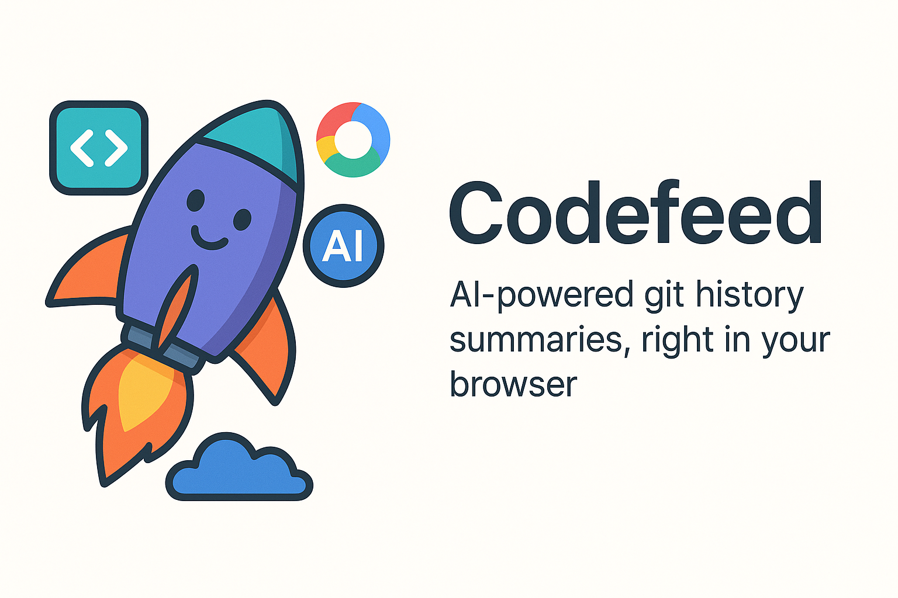
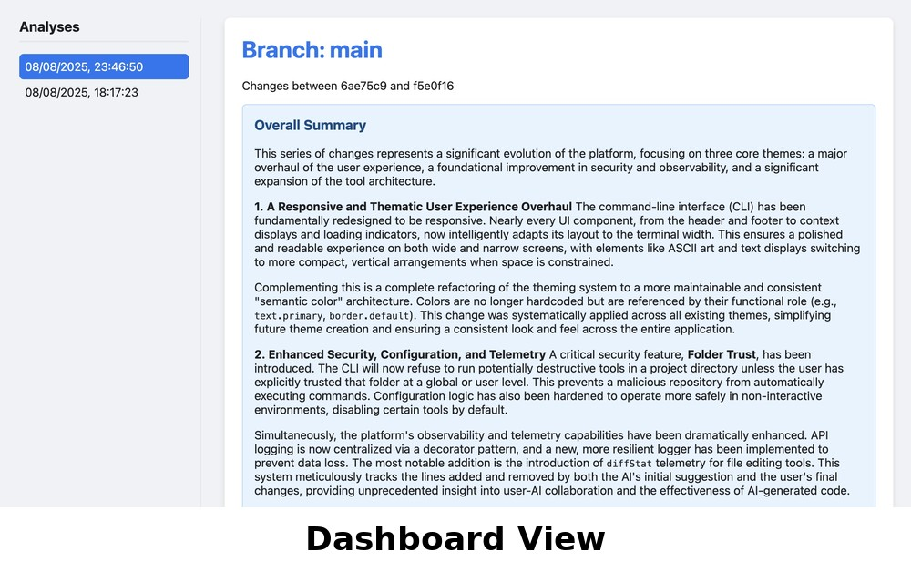
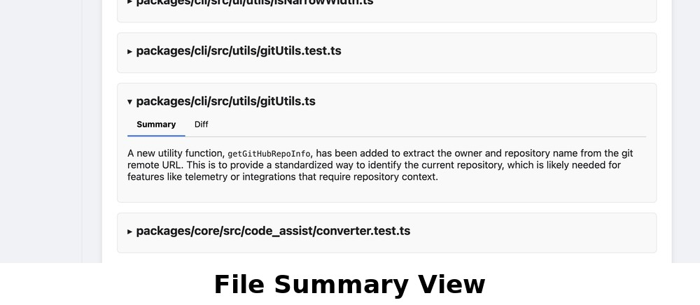
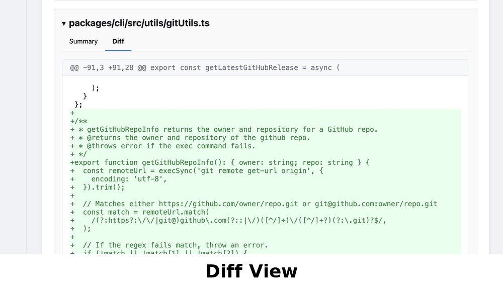

<p align="center">
  
</p>

# Codefeed 🚀

AI-powered git history summaries, right in your browser. Codefeed is a CLI tool that analyzes your git repository's recent changes and generates clear, high-level summaries for each branch and file, helping you quickly understand the evolution of your codebase.

## Table of Contents
- [Getting Started](#getting-started)
  - [1. Get Your Gemini API Key](#1-get-your-gemini-api-key)
  - [2. Set the Environment Variable](#2-set-the-environment-variable)
  - [3. Install Codefeed](#3-install-codefeed)
  - [4. Run Codefeed](#4-run-codefeed)
- [Features](#features)
- [Understanding the Feed](#understanding-the-feed-a-timeline-of-your-work)
- [How It Works](#how-it-works)
- [License](#license)

## Getting Started

### 1. Get Your Gemini API Key
Codefeed uses the Google Gemini API to generate summaries.
1.  Go to [Google AI Studio](https://aistudio.google.com/).
2.  Click **"Get API key"** and follow the instructions to create a new API key.

### 2. Set the Environment Variable
Your API key must be available as an environment variable named `GEMINI_API_KEY`.

**Mac/Linux:**
```bash
export GEMINI_API_KEY="YOUR_API_KEY_HERE"
```
*(To make this permanent, add it to your shell's startup file, like `~/.zshrc` or `~/.bashrc`)*

**Windows (Command Prompt):**
```cmd
setx GEMINI_API_KEY "YOUR_API_KEY_HERE"
```

### 3. Install Codefeed
```bash
npm install -g codefeed
```

### 4. Run Codefeed
1.  Navigate to any local git repository:
    ```bash
    cd /path/to/your/project
    ```
2.  Run the command:
    ```bash
    codefeed
    ```
3.  Your browser will open with the dashboard, and the analysis will begin.

> **Note:** Codefeed is smart! If you run it again without any new commits or pulls, it won't re-run the analysis. It knows the work has already been summarized. To generate a new analysis, you need to either `git pull` new changes or make new local commits.

## What is Codefeed?

Tired of deciphering long, complex git logs? Codefeed connects to Google's powerful Gemini AI model to do the heavy lifting for you.

Run a single command in your repository, and Codefeed will:
- **Analyze recent commits** on your main and current branches.
- **Generate a high-level summary** of the overall changes.
- **Provide a detailed summary for each modified file**, focusing on the "why" behind the changes, not just the "what".
- **Launch a local web dashboard** for you to interactively explore the analysis.

## Features

- **🌐 Interactive Dashboard & Analysis History:** The dashboard displays a series of analyses. Each analysis is a snapshot of the changes made since your last `git pull`, captured at the moment you run the tool. This creates a historical timeline, allowing you to browse and review summaries from different points in your development process.
<p align="center">
  
</p>

- **🤖 AI-Powered Summaries:** Leverages generative AI to create human-readable explanations of your code changes.
<p align="center">
  
</p>

- **📄 Detailed Diff Viewer:** A GUI-style diff viewer for each file, showing additions and deletions in a clear, hunk-by-hunk format.
<p align="center">
  
</p>

- **🧠 Smart Analysis:** Automatically detects the commit range since your last `git pull` and analyzes your local work.
- **⚡️ Efficient:** Caches analyses to avoid re-processing the same commit ranges, saving you time and API calls.
- **⚙️ Configurable:** Choose your preferred Gemini model (e.g., `gemini-2.5-flash`) during the initial setup.

## Understanding the Feed: A Timeline of Your Work

> ❗️ **Important:** You won't see a feed of multiple analyses immediately in a new repository. Codefeed builds its history over time. Each time you run `codefeed`, it creates **one** analysis summarizing the work done since your last `git pull`.

To see the feed grow, you need to introduce changes over time. Here’s a typical workflow:

#### Day 1: Your First Analysis
1.  `git clone https://github.com/some/project.git`
2.  `cd project`
3.  Run `codefeed`
    - **Result:** The first analysis is created. It establishes a baseline. The dashboard shows one item.

#### Day 2: New Changes
1.  Your team pushes updates to the remote repository.
2.  You run `git pull` to get these updates.
3.  You do some work and make a few of your own local commits.
4.  Run `codefeed` again.
    - **Result:** A **new** analysis appears in the dashboard. It summarizes all the changes (from the pull and your local work) that have occurred since the first run. You now have a feed of two analyses.

## How It Works

Codefeed is designed to analyze the work you've done locally before you push it. It intelligently determines the correct range of commits to summarize by inspecting your repository's `reflog`.

1.  **Finds the Last Sync Point:** It scans the `reflog` (a log of all local `HEAD` movements) to find the most recent `git pull` or `fetch` from your remote `origin`. This marks the starting point.
2.  **Gets Your Current State:** It uses your current `HEAD` as the ending point.
3.  **Generates the Diff:** It creates a diff between these two points and sends it to the AI for summarization.

Because the `reflog` is stored locally in your `.git` directory, Codefeed can find your last sync point even if you installed it long after you last pulled.

#### ✔️ Local Commits are Included
Because Codefeed analyzes the commits up to your current `HEAD`, **it will include all local commits you have made**, even if you haven't pushed them to the remote repository yet. This is perfect for summarizing your work before creating a pull request.

#### ❌ Unstaged Changes are Not Included
Codefeed operates on your repository's commit history. Therefore, **it does not see or analyze any unstaged or uncommitted changes**. Always commit your work before running `codefeed` to ensure it's included in the analysis.

## License

This project is licensed under the MIT License.
